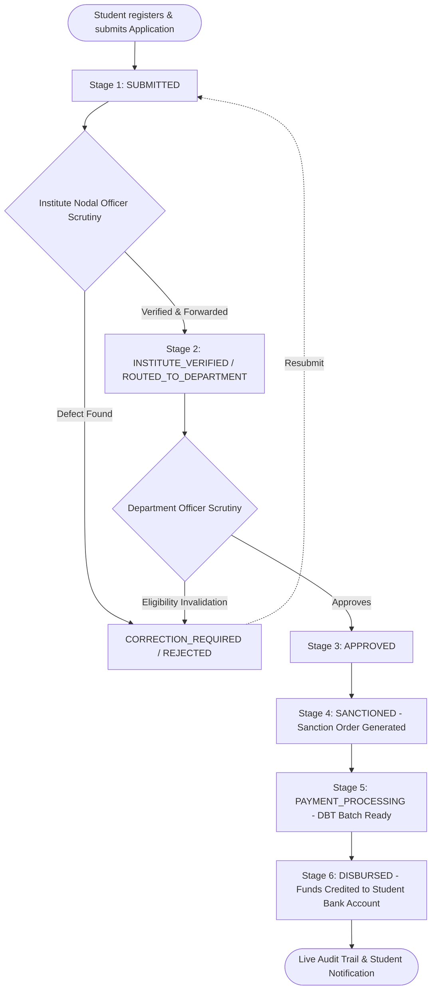

# National Scholarship Application Verification and Disbursement Tracking Management System

[](https://nodejs.org/)
[](https://expressjs.com/)
[](https://react.dev/)
[](https://www.mongodb.com/)
[](LICENSE)

An end-to-end, enterprise-grade **National Scholarship Application, Multi-Level Verification, Sanction Order Generation, and Direct Benefit Transfer (DBT) Disbursement Tracking Platform** built with the **MERN Stack** (MongoDB, Express.js, React.js, Node.js).

The system seamlessly orchestrates the full scholarship lifecycle across **4 interconnected role-based portals**:
1. 🎓 **Student Portal** — Scheme discovery, multi-step application, live milestone tracking, DBT payments ledger.
2. 🏛️ **Institute Officer Portal** — College-level nodal scrutiny, academic & fee verification, defect/rejection management.
3. 🏢 **Department Officer Portal** — Ministry/State verification, quota evaluation, Sanction Order generation, DBT payment batch processing, budget tracking.
4. ⚙️ **Central Administrator Portal** — System KPI monitoring, Scheme management, Department & Institution onboarding, RBAC user control, immutable audit logs.

---

## 📑 Table of Contents

- [System Architecture & Lifecycle Workflow](#-system-architecture--lifecycle-workflow)
- [Portals & Feature Matrix](#-portals--feature-matrix)
- [Tech Stack](#-tech-stack)
- [Project Directory Structure](#-project-directory-structure)
- [Getting Started & Installation](#-getting-started--installation)
  - [Prerequisites](#prerequisites)
  - [Backend Setup](#1-backend-setup)
  - [Frontend Setup](#2-frontend-setup)
  - [One-Click Database Seeding](#3-one-click-database-seeding)
- [Default Demo Credentials](#-default-demo-credentials)
- [REST API Reference](#-rest-api-reference)
- [End-to-End Automated Testing](#-end-to-end-automated-testing)
- [Security & Architecture Highlights](#-security--architecture-highlights)

---

## 🏛️ System Architecture & Lifecycle Workflow

The platform implements a strict 7-stage state machine that models real-world government DBT scholarship workflows:



---

## 🚀 Portals & Feature Matrix

### 1. 🎓 Student Portal (`/student/*`)
- **Interactive Dashboard**: High-level metrics, active application statuses, notifications banner, and recommended scholarships.
- **Scheme Discovery & Details**: Filter schemes by Category (*Merit, Need, Girl Child, SC/ST/OBC, Corporate*), deadline countdowns, eligibility criteria, and benefit structures.
- **Multi-Step Application Wizard**:
  - **Step 1: Personal Details** (Aadhaar, category, contact, address).
  - **Step 2: Academic Details** (Institute, enrollment ID, CGPA/percentage, attendance).
  - **Step 3: Income & Family** (Annual income, Tahsildar certificate ID, occupation).
  - **Step 4: DBT Bank Account** (Account number, IFSC code, bank branch, holder verification).
  - **Step 5: Document Uploads & Declaration**.
- **Real-Time Stage Tracker**: Visual progress stepper displaying current stage (*Submitted ➔ Institute Verified ➔ Department Approved ➔ Sanctioned ➔ Disbursed*), officer remarks, and timeline history.
- **DBT Payment Ledger**: Detailed transaction history with UTR / Reference IDs, credit dates, sanction order numbers, and payment status badges.
- **Profile Management**: Maintain verified personal, academic, and banking credentials.

---

### 2. 🏛️ Institute Officer Portal (`/institute/*`)
- **Nodal Officer Dashboard**: Institutional queue metrics (Pending, Verified, Defective, Total Students).
- **Application Verification Queue**: Multi-filter datatable (by Scheme, Academic Year, Caste Category, and Application Status).
- **Detailed Verification Dossier**:
  - Side-by-side verification of student-submitted marks against institute records.
  - Attendance check and course validity confirmation.
  - One-click actions: **Verify & Forward to Department**, **Mark as Defective (Correction Required)**, or **Reject** with mandatory officer remarks.
- **Registered Students Master List**: Directory of enrolled students under the institution with course, year, and scholarship history.
- **Institutional Notifications**: Real-time broadcast and action-required updates.

---

### 3. 🏢 Department Officer Portal (`/department/*`)
- **Department Overview & Budget Analytics**: Allocated budget vs. committed sanctions vs. disbursed funds visualization.
- **Departmental Verification Queue**: Scrutiny of institute-verified applications, quota evaluation, and merit-income verification.
- **Sanction Order Generation**:
  - Batch generation of official Sanction Orders with unique Sanction Numbers and allocation dates.
  - Auto-calculation of sanctioned amounts per applicant.
- **DBT Disbursement Management**:
  - Batching sanctioned applications into payment schedules.
  - Direct Benefit Transfer (DBT) processing with bank transaction references (UTR).
  - Real-time disbursement confirmations and ledger updates.
- **Analytical & Compliance Reports**: Breakdown by Caste Category, Gender Ratio, District/State distribution, and Scheme utilization.

---

### 4. ⚙️ Central Administrator Portal (`/admin/*`)
- **Executive Control Room**: Live KPI dashboards tracking national metrics, total funds disbursed, active institutions, and verified applications.
- **Scholarship Scheme Builder**: Create, update, toggle active status, set income limits, and configure award criteria for government and private schemes.
- **Department & Ministry Management**: Register funding departments (Government, Private Trusts, Corporate CSR), assign budget limits, and associate departmental officers.
- **Accredited Institutions Registry**: Manage affiliated universities and colleges, verify institutional codes, and assign institute nodal officers.
- **Unified RBAC User Management**: Search, filter, activate, or suspend accounts across all 4 user roles (*Students, Institute Officers, Department Officers, Administrators*).
- **Master Applications Inspector**: Global view of all applications across every department, stage, and state.
- **Immutable Audit Trail (`/admin/audit-logs`)**: Real-time logging of every critical state change, actor ID, role, timestamp, action type, and IP address.
- **Notifications Engine**: Broadcast systemic announcements or targeted notifications.

---

## 🛠️ Tech Stack

| Domain | Technology / Library | Description |
|---|---|---|
| **Frontend Framework** | React.js (v18.2) | Component-driven SPA architecture |
| **Routing** | React Router DOM (v6.20) | Role-protected client-side routing & deep linking |
| **UI & Styling** | Bootstrap 5, Bootstrap Icons, Lucide React, Custom CSS | Modern glassmorphism, responsive data grids, accessible UI |
| **Data Visualization** | Recharts (v3.10) | Interactive charts for budget burn-down, quotas, and demographics |
| **Alerts & Modals** | SweetAlert2 | Polished operational dialogs and confirmations |
| **HTTP Client** | Axios (v1.6) | Authenticated API calls with JWT Bearer Interceptors |
| **Backend Server** | Node.js & Express.js (v4.18) | Scalable REST API with modular controllers and middleware |
| **Database** | MongoDB & Mongoose (v8.0) | Schema validation, indexing, and transactional data integrity |
| **Authentication** | JWT (JSON Web Tokens) & BcryptJS | Secure token-based session management and salted password hashing |

---

## 📂 Project Directory Structure

```text
national-scholarship-system/
├── server/                         # Backend Express API Server (Port 5000)
│   ├── config/
│   │   └── db.js                   # MongoDB connection configuration
│   ├── controllers/
│   │   ├── authController.js       # Authentication & user profile logic
│   │   ├── studentController.js    # Student application, tracking, payment APIs
│   │   ├── instituteController.js  # Institute scrutiny & verification APIs
│   │   ├── departmentController.js # Department approval, sanction & disbursement APIs
│   │   ├── adminPortalController.js# Central admin management & audit log APIs
│   │   └── seedController.js       # Database seeder with realistic demo data
│   ├── middleware/
│   │   └── auth.js                 # JWT verification & RBAC role guards
│   ├── models/
│   │   ├── User.js                 # Unified User & Profile model (RBAC)
│   │   ├── Application.js          # Master scholarship application state machine
│   │   ├── Scholarship.js          # Schemes & eligibility criteria
│   │   ├── Institution.js          # Accredited colleges/universities
│   │   ├── Department.js           # Ministries / Corporate funding bodies
│   │   ├── Sanction.js             # Sanction orders & allocations
│   │   ├── Payment.js              # DBT transaction records & UTR ledger
│   │   ├── AuditLog.js             # Tamper-evident action logging
│   │   └── Notification.js         # User alerts & systemic announcements
│   ├── routes/
│   │   ├── authRoutes.js
│   │   ├── studentRoutes.js
│   │   ├── instituteRoutes.js
│   │   ├── departmentRoutes.js
│   │   ├── adminPortalRoutes.js
│   │   └── seedRoutes.js
│   ├── test_e2e_flow.js            # Automated end-to-end verification script
│   ├── package.json
│   ├── .env                        # Server environment configuration
│   └── server.js                   # Application entry point
│
├── client/                         # Unified React Frontend (Port 3000)
│   ├── public/
│   │   └── index.html
│   ├── src/
│   │   ├── components/
│   │   │   ├── common/             # ProtectedRoute, Navbar, Sidebar, Modals
│   │   │   ├── student/            # Student sub-components
│   │   │   ├── institute/          # Institute scrutiny components
│   │   │   ├── department/         # Department sanction/disbursement widgets
│   │   │   └── admin/              # Admin CRUD modals and metric cards
│   │   ├── context/
│   │   │   └── AuthContext.js      # Global authentication state
│   │   ├── pages/
│   │   │   ├── auth/               # Login, Register, Role-specific login pages
│   │   │   ├── student/            # Dashboard, Scholarships, Apply, Tracking, Payments
│   │   │   ├── institute/          # Dashboard, Applications, Verification, Students
│   │   │   ├── department/         # Dashboard, Applications, Sanctions, Disbursement, Reports
│   │   │   └── admin/              # Dashboard, Schemes, Departments, Institutes, Users, Audit
│   │   ├── services/
│   │   │   └── api.js              # Centralized Axios client & API endpoints
│   │   ├── App.js                  # Application routes & role hierarchy
│   │   ├── index.css               # Design system, tokens, and theme styles
│   │   └── index.js
│   ├── package.json
│   └── .env                        # React app environment variables
│
└── README.md                       # Project documentation
```

---

## ⚡ Getting Started & Installation

### Prerequisites
- **Node.js**: v18.0.0 or higher
- **npm**: v9.0.0 or higher
- **MongoDB**: Local MongoDB instance (`mongodb://127.0.0.1:27017/national-scholarship-db`) or a MongoDB Atlas connection string.

---

### 1. Backend Setup

1. Open a terminal and navigate to the `server` directory:
   ```bash
   cd server
   ```
2. Install dependencies:
   ```bash
   npm install
   ```
3. Create/Verify the `.env` file in the `server` folder:
   ```env
   PORT=5000
   MONGO_URI=mongodb://127.0.0.1:27017/national-scholarship-db
   JWT_SECRET=nsp_super_secure_jwt_secret_key_2026_scholarship_system
   NODE_ENV=development
   ```
4. Start the backend API server:
   ```bash
   npm start
   # Or for development auto-reload:
   npm run dev
   ```
   *The server will be available at `http://localhost:5000`.*

---

### 2. Frontend Setup

1. Open a second terminal and navigate to the `client` directory:
   ```bash
   cd client
   ```
2. Install dependencies:
   ```bash
   npm install
   ```
3. Create/Verify the `.env` file in the `client` folder:
   ```env
   PORT=3000
   REACT_APP_API_URL=http://localhost:5000/api
   ```
4. Start the React development server:
   ```bash
   npm start
   ```
   *The application will automatically launch at `http://localhost:3000`.*

---

### 3. One-Click Database Seeding

To quickly populate the database with pre-configured institutions, departments, active scholarship schemes, demo students, applications across all verification stages, sanction orders, and DBT payment logs:

- Send a **POST** or **GET** request to:
  ```http
  POST http://localhost:5000/api/seed
  ```
- Or open your browser and navigate directly to:
  ```text
  http://localhost:5000/api/seed
  ```

---

## 🔑 Default Demo Credentials

After running the database seeder, you can log into any portal using the following credentials:

| Portal | Role | Email | Password | Assigned Unit / Scope |
|---|---|---|---|---|
| **Central Admin** | `ADMIN` | `admin@nsp.gov.in` | `admin123` | Full System & Audit Access |
| **Institute Portal** | `INSTITUTE_OFFICER` | `institute@nsp.gov.in` | `institute123` | NIT Delhi (`NITD-101`) |
| **Department Portal** | `DEPARTMENT_OFFICER` | `department@nsp.gov.in` | `department123` | Ministry of Higher Education & Welfare |
| **Student Portal** | `STUDENT` | `student@nsp.gov.in` | `student123` | Aarav Sharma (3rd Yr B.Tech) |
| **Student Portal** | `STUDENT` | `priya.patel@nsp.gov.in` | `password123` | Priya Patel (2nd Yr B.Tech) |
| **Student Portal** | `STUDENT` | `rahul.verma@nsp.gov.in` | `password123` | Rahul Verma (4th Yr B.Tech) |

> 💡 **Self-Registration**: New students can also self-register directly through the `/register` page by selecting their accredited institution and completing their student biodata.

---

## 📡 REST API Reference

### 🔐 Authentication & Profile (`/api/auth`)
| Method | Endpoint | Access | Description |
|---|---|---|---|
| `POST` | `/api/auth/register` | Public | Register a new Student account |
| `POST` | `/api/auth/login` | Public | Authenticate user & issue JWT |
| `GET` | `/api/auth/me` | Authenticated | Retrieve current user profile |
| `PUT` | `/api/auth/profile` | Authenticated | Update user details & biodata |
| `GET` | `/api/auth/institutions` | Public | List active institutions for registration dropdown |

---

### 🎓 Student Endpoints (`/api/student`)
| Method | Endpoint | Access | Description |
|---|---|---|---|
| `GET` | `/api/student/dashboard` | Student | Fetch student summary metrics & recent applications |
| `GET` | `/api/student/scholarships` | Student | Catalog of available scholarships with eligibility info |
| `GET` | `/api/student/scholarships/:id` | Student | Detailed breakdown of a specific scheme |
| `POST` | `/api/student/apply` | Student | Submit a multi-step scholarship application |
| `GET` | `/api/student/applications` | Student | List all applications submitted by the logged-in student |
| `GET` | `/api/student/applications/:id` | Student | Real-time milestone tracker for an application |
| `GET` | `/api/student/payments` | Student | DBT payment history and bank transaction status |
| `GET` | `/api/student/notifications` | Student | Fetch student alerts and notifications |

---

### 🏛️ Institute Officer Endpoints (`/api/institute`)
| Method | Endpoint | Access | Description |
|---|---|---|---|
| `GET` | `/api/institute/dashboard` | Institute Officer | Institute verification statistics and pending count |
| `GET` | `/api/institute/applications` | Institute Officer | Queue of student applications pending institute scrutiny |
| `GET` | `/api/institute/applications/:id` | Institute Officer | Full application dossier & verification details |
| `PUT` | `/api/institute/applications/:id/verify` | Institute Officer | Verify, defect, or reject application with officer remarks |
| `GET` | `/api/institute/students` | Institute Officer | Directory of enrolled students under the institution |
| `GET` | `/api/institute/notifications` | Institute Officer | Institutional alerts and action items |

---

### 🏢 Department Officer Endpoints (`/api/department`)
| Method | Endpoint | Access | Description |
|---|---|---|---|
| `GET` | `/api/department/dashboard` | Dept Officer | Department stats, budget burn-down, and verification counts |
| `GET` | `/api/department/applications` | Dept Officer | Queue of institute-verified applications |
| `GET` | `/api/department/applications/:id` | Dept Officer | Application dossier for department-level scrutiny |
| `PUT` | `/api/department/applications/:id/verify` | Dept Officer | Approve, reject, or request correction with remarks |
| `GET` | `/api/department/sanctions` | Dept Officer | List sanction orders and sanctioned applications |
| `POST` | `/api/department/sanctions/generate` | Dept Officer | Generate Sanction Order for approved applications |
| `GET` | `/api/department/disbursement` | Dept Officer | Queue of applications pending DBT disbursement |
| `POST` | `/api/department/disbursement/process` | Dept Officer | Process DBT batch and create transaction records |
| `GET` | `/api/department/reports` | Dept Officer | Demographic, scheme, and financial analytical reports |
| `GET` | `/api/department/notifications` | Dept Officer | Departmental notifications |

---

### ⚙️ Central Administrator Endpoints (`/api/admin`)
| Method | Endpoint | Access | Description |
|---|---|---|---|
| `GET` | `/api/admin/dashboard` | Admin | System-wide executive KPIs and fund flow statistics |
| `GET` / `POST` | `/api/admin/scholarships` | Admin | List or create scholarship schemes |
| `PUT` / `DELETE`| `/api/admin/scholarships/:id` | Admin | Update or delete a scholarship scheme |
| `GET` / `POST` | `/api/admin/departments` | Admin | List or register funding departments |
| `PUT` / `DELETE`| `/api/admin/departments/:id` | Admin | Update or delete a department |
| `GET` / `POST` | `/api/admin/institutions` | Admin | List or register accredited institutions |
| `PUT` / `DELETE`| `/api/admin/institutions/:id` | Admin | Update or delete an institution |
| `GET` / `POST` | `/api/admin/users` | Admin | Master RBAC user directory & user provisioning |
| `PUT` / `DELETE`| `/api/admin/users/:id` | Admin | Update user role/status or remove user |
| `GET` | `/api/admin/applications` | Admin | Master application queue across all departments |
| `GET` | `/api/admin/reports` | Admin | Central compliance and analytical reports |
| `GET` | `/api/admin/audit-logs` | Admin | Real-time audit logs of system-wide actions |
| `GET` | `/api/admin/notifications` | Admin | Central notifications overview |

---

## 🧪 End-to-End Automated Testing

A complete automated end-to-end testing script is included in `server/test_e2e_flow.js` that tests the entire lifecycle programmatically:
1. Verifies server health status.
2. Seeds demo data.
3. Registers a brand-new student account.
4. Completes student profile biodata.
5. Submits a new scholarship application.
6. Authenticates as the **Institute Officer** and verifies the application.
7. Authenticates as the **Department Officer** and approves the application.
8. Generates an official **Sanction Order**.
9. Executes **DBT Disbursement** with bank transaction IDs.
10. Validates the final **Payment Ledger** and **Audit Log** entries.

### Run the E2E Test Suite:
Ensure the backend server is running on port 5000, then execute:
```bash
cd server
node test_e2e_flow.js
```

---

## 🔒 Security & Architecture Highlights

- **Role-Based Access Control (RBAC)**: Enforced at both the Express middleware layer (`auth.js`) and React client layer (`ProtectedRoute.js`) across 4 roles: `STUDENT`, `INSTITUTE_OFFICER`, `DEPARTMENT_OFFICER`, and `ADMIN`.
- **Stateless Authentication**: Signed JSON Web Tokens (JWT) with configurable expiry transmitted via standard `Authorization: Bearer <token>` headers.
- **Tamper-Evident Audit Logging**: Every critical lifecycle transition (application submission, verification, sanctioning, disbursement, user updates) automatically writes an immutable log to MongoDB with actor ID, IP, role, and action timestamps.
- **Direct Benefit Transfer (DBT) Safeguards**: Validates student bank account structures, IFSC codes, and Tahsildar income certificates before sanction order eligibility.

---

## 📄 License

This project is licensed under the [MIT License](LICENSE).
