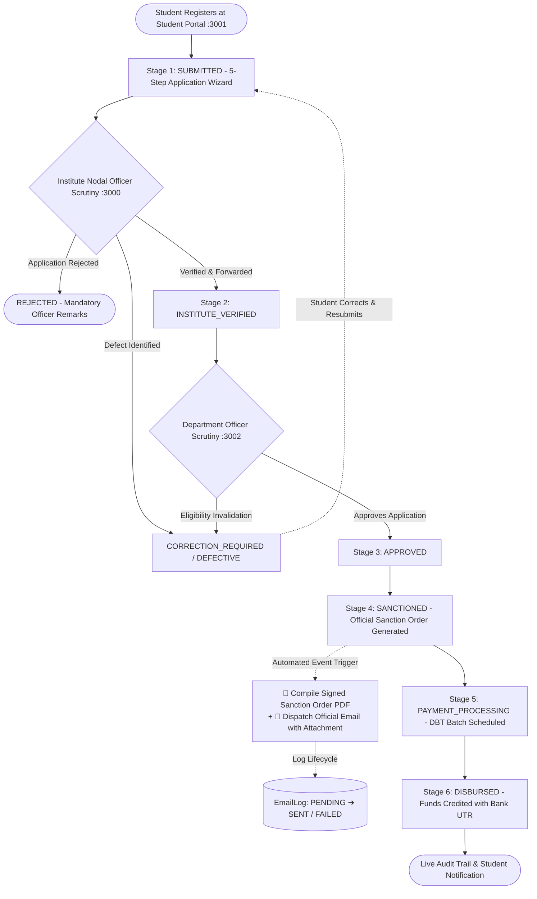
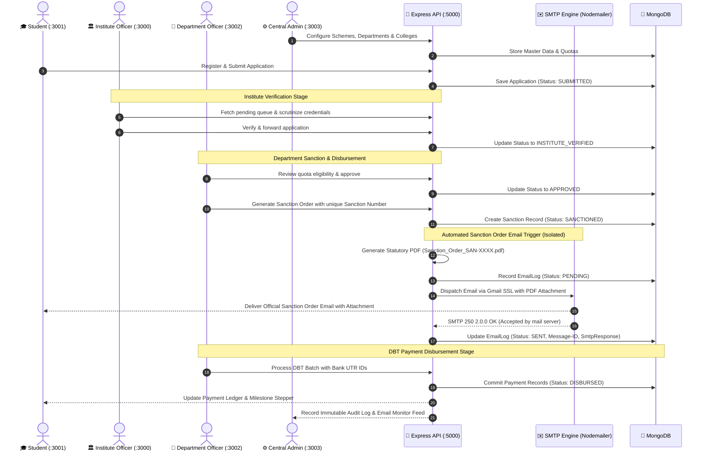

# National Scholarship Application Verification and Disbursement Tracking Management System

[](https://nodejs.org/)
[](https://expressjs.com/)
[](https://react.dev/)
[](https://www.mongodb.com/)
[](LICENSE)

An end-to-end, enterprise-grade **National Scholarship Application, Multi-Level Institutional Scrutiny, Sanction Order Generation, and Direct Benefit Transfer (DBT) Disbursement Tracking Platform** built on the **MERN Stack** (MongoDB, Express.js, React 18, Node.js).

The architecture is engineered as a **distributed multi-portal system**, orchestrating the scholarship lifecycle across **4 independent role-specific client portals** powered by a unified Express REST API backend:

| Portal | URL & Port | Target User Role | Key Responsibilities |
|---|---|---|---|
| 🏛️ **Institute Portal** | `http://localhost:3000` | `INSTITUTE_OFFICER` | College-level nodal scrutiny, admission & academic verification, defect/rejection management |
| 🎓 **Student Portal** | `http://localhost:3001` | `STUDENT` | Scheme discovery, 5-step application wizard, live milestone tracker, DBT bank ledger |
| 🏢 **Department Portal** | `http://localhost:3002` | `DEPARTMENT_OFFICER` | Ministry/State quota evaluation, Sanction Order generation, DBT payment batch processing |
| ⚙️ **Central Admin Portal** | `http://localhost:3003` | `ADMIN` / `SUPER_ADMIN` | Executive KPI control room, scheme builder, department/college onboarding, RBAC, immutable audit trail |
| 🌐 **Backend API Server** | `http://localhost:5000` | All Clients / Services | REST API, JWT auth, MongoDB transactional models, automated E2E lifecycle workflows |

---

## 📑 Table of Contents

- [System Architecture & Lifecycle Workflow](#-system-architecture--lifecycle-workflow)
- [Multi-Portal Feature Matrix](#-multi-portal-feature-matrix)
- [Technology Stack](#-technology-stack)
- [Project Directory Structure](#-project-directory-structure)
- [Getting Started & Installation](#-getting-started--installation)
  - [Prerequisites](#prerequisites)
  - [1. Backend Server Setup](#1-backend-server-setup)
  - [2. Multi-Portal Client Setup](#2-multi-portal-client-setup)
  - [3. Database Initialization & Seeding](#3-database-initialization--seeding)
- [Pre-Configured Demo Credentials](#-pre-configured-demo-credentials)
- [⚡ Service Level Performance (SLP) & SLA Escalation Engine](#-service-level-performance-slp--sla-escalation-engine)
  - [Demo Mode vs. Production Mode](#demo-mode-vs-production-mode)
  - [SLA State Lifecycle & Visual Identifiers](#sla-state-lifecycle--visual-identifiers)
  - [Zero-Disruption Escalation Principle](#zero-disruption-escalation-principle)
  - [Central Admin SLP Monitor Dashboard](#central-admin-slp-monitor-dashboard)
- [📧 Automated Sanction Order Email & PDF Dispatch System](#-automated-sanction-order-email--pdf-dispatch-system)
  - [Dedicated Workflow Trigger & Stage Isolation](#dedicated-workflow-trigger--stage-isolation)
  - [Government-Styled PDF Sanction Order Generation](#government-styled-pdf-sanction-order-generation)
  - [Nodemailer SMTP Architecture & Gmail SSL Configuration](#nodemailer-smtp-architecture--gmail-ssl-configuration)
  - [Central Admin Email Dispatch Monitor & Live Retry](#central-admin-email-dispatch-monitor--live-retry)
  - [Statutory Sanction Email Template](#statutory-sanction-email-template)
- [📡 REST API Reference](#-rest-api-reference)
  - [SLP Performance & Escalation Endpoints](#-slp-performance--escalation-endpoints-apislp)
  - [Automated Email Dispatch Endpoints](#-automated-email-dispatch-endpoints-apiemails--apiadmin)
- [🧪 Automated Verification & Test Suites](#-automated-verification--test-suites)
  - [1. Automated Sanction Email & PDF Test Suite](#1-automated-sanction-email--statutory-pdf-test-suite-test_sanction_email_workflowjs)
  - [2. SLP Demo Mode & Auto-Escalation Suite](#2-slp-demo-mode--auto-escalation-suite-test_slp_demo_flowjs)
  - [3. Strict 5-Stage Sequential Workflow Test](#3-strict-5-stage-sequential-workflow-test-test_workflow_sequencejs)
  - [4. Full End-to-End Test](#4-full-end-to-end-test-test_e2e_flowjs)
  - [5. Student-to-Institute Scrutiny Flow](#5-student-to-institute-scrutiny-flow-test_student_institute_flowjs)
- [🔒 Security & Architecture Highlights](#-security--architecture-highlights)
- [📄 License](#-license)

---

## 🏛️ System Architecture & Lifecycle Workflow

The platform enforces a strict sequential 7-stage state machine that models real-world government and corporate scholarship workflows:



### Detailed Lifecycle Sequence



---

## 🚀 Multi-Portal Feature Matrix

### 1. 🎓 Student Portal (`http://localhost:3001`)
*Repository folder: `client-student`*

- **Applicant Registration & Onboarding (`/register`)**:
  - Self-service student registration with dynamic institution selector populated from active accredited colleges.
  - Captures course details, date of birth, category, family income, and DBT bank account info.
- **Student Dashboard (`/dashboard`)**:
  - Real-time application statistics, recent submissions, payment notices, and active scheme recommendations.
- **Scholarship Scheme Catalog (`/student/scholarships`)**:
  - Filter schemes by Provider (*Government, Private Trusts, Corporate CSR*), Education Level, and Categories.
  - Detailed scheme inspection (`/student/scholarships/:id`) displaying eligibility criteria, income thresholds, minimum CGPA/percentage, and benefit structure.
- **5-Step Scholarship Application Wizard (`/student/apply/:id`)**:
  - **Step 1: Personal Details** (Full name, Aadhaar number, category, gender, mobile, address).
  - **Step 2: Academic Details** (Selected institution, enrollment ID, course, year of study, CGPA / marks percentage).
  - **Step 3: Income & Family** (Annual family income, father/guardian occupation, Tahsildar income certificate ID).
  - **Step 4: DBT Bank Account** (Account holder name, account number, bank name, IFSC code, branch).
  - **Step 5: Document Uploads & Self-Declaration** (Income certificate, academic transcripts, ID proof, declaration checkbox).
- **Interactive Milestone Application Tracker (`/student/applications/:id`)**:
  - Visual 5-stage progress stepper (*Submitted ➔ Institute Verified ➔ Department Approved ➔ Sanctioned ➔ Disbursed*).
  - Detailed remarks history from Institute and Department scrutiny officers.
  - Ability to edit and resubmit defective applications marked for correction.
- **DBT Payment Ledger (`/student/payments`)**:
  - Direct Benefit Transfer breakdown showing official Sanction Order numbers, Bank Reference / UTR IDs, disbursement dates, and payment badges.
- **Student Profile Management (`/student/profile`)**:
  - View and update contact details, verified academic credentials, and bank account settings.

---

### 2. 🏛️ Institute Officer Portal (`http://localhost:3000`)
*Repository folder: `client-institute`*

- **Nodal Officer Command Center (`/institute/dashboard`)**:
  - Key metrics on total applications under the college, pending scrutiny, verified & forwarded, and defective applications.
- **Multi-Filter Verification Queue (`/institute/applications`)**:
  - Real-time datatable filterable by Scholarship Scheme, Academic Year, Caste Category, and Application Status.
- **Comprehensive Scrutiny Dossier (`/institute/applications/:id`)**:
  - Side-by-side evaluation of student-submitted CGPA/marks against institutional records.
  - Admission status and minimum attendance verification.
  - Document verification viewer (Aadhaar, income certificates, transcripts).
  - **One-Click Actions**:
    - **Verify & Forward to Department** (advances to `INSTITUTE_VERIFIED`).
    - **Request Correction / Mark Defective** (reverts to `CORRECTION_REQUIRED` with mandatory officer notes).
    - **Reject Application** (terminates with formal reason).
- **Institution Student Directory (`/institute/students`)**:
  - Master roster of enrolled students affiliated with the institution, tracking past and active scholarship awards.
- **Institutional Notifications (`/institute/notifications`)**:
  - Department bulletins, verification deadline alerts, and system broadcasts.

---

### 3. 🏢 Department Officer Portal (`http://localhost:3002`)
*Repository folder: `client-dept`*

- **Department Analytics & Budget Cockpit (`/department/dashboard`)**:
  - Live budget burn-down visualization: Allocated Ministry Budget vs. Committed Sanctions vs. Disbursed Funds.
- **Department Verification Queue (`/department/applications`)**:
  - Scrutiny of institute-verified applications forwarded across affiliated colleges and universities.
  - Quota verification, income-threshold cross-checking, and final department approval (`APPROVED`).
- **Official Sanction Order Generation (`/department/sanctions`)**:
  - Filter approved applications ready for sanctioning.
  - Batch generation of official Sanction Orders with auto-generated unique Sanction Numbers (e.g., `SAN-2026-XXXX`).
  - Allocation of committed grant amounts deducted against the department's authorized budget.
  - **Automated PDF & Email Dispatch Trigger**: Synchronously compiles the formal, digitally signed Sanction Order PDF (`Sanction_Order_SAN-XXXX.pdf`) and triggers the SMTP engine to email the student directly with the PDF attached. Non-blocking error containment ensures sanctioning remains intact even if SMTP experiences transient network outages.
- **DBT Payment Disbursement Batching (`/department/disbursement`)**:
  - Queue of sanctioned candidates awaiting Direct Benefit Transfer.
  - Batch processing interface simulating secure PFMS / DBT gateway payout execution.
  - Automatic generation of Bank Reference / UTR transaction numbers with timestamped audit entries.
- **Compliance & Demographic Reports (`/department/reports`)**:
  - Analytics broken down by Caste Category (SC/ST/OBC/General), Gender Ratios, District & State spread, and Scheme Utilization.
- **Department Notifications (`/department/notifications`)**:
  - State circulars, quota revision alerts, and audit updates.

---

### 4. ⚙️ Central Administrator Portal (`http://localhost:3003`)
*Repository folder: `client-admin`*

- **Executive KPI Dashboard (`/admin/dashboard`)**:
  - Nationwide system metrics: Total Applications, Verification Throughput, Sanctioned Funds, Active Schemes, Institutions, and Departments.
- **Scholarship Scheme Builder (`/admin/scholarships`)**:
  - Full CRUD operations: Create new schemes, configure funding departments, specify eligible courses, set income thresholds, minimum CGPA, award amounts, and toggle active/inactive status.
- **Department & Ministry Management (`/admin/departments`)**:
  - Register government ministries, state departments, private trusts, or corporate CSR funds.
  - Configure allocated budget ceilings and assign Department Nodal Officers.
- **Accredited Institutions Registry (`/admin/institutions`)**:
  - Onboard colleges and universities with institutional codes (e.g., `NITD-101`, `IITD-202`).
  - Manage contact info, location data, and assign Institute Verification Officers.
- **Unified RBAC User Management (`/admin/users`)**:
  - Global user directory with multi-role filtering (`ADMIN`, `DEPARTMENT_OFFICER`, `INSTITUTE_OFFICER`, `STUDENT`).
  - Reset passwords, activate/suspend accounts, or provision new administrative users.
- **Master Applications Inspector (`/admin/applications`)**:
  - Unrestricted view of every application across all institutions, departments, and stages with search and stage filters.
- **Automated Sanction Email Dispatch Monitor (`/admin/email-logs`)**:
  - Real-time audit dashboard for all official sanction emails dispatched to scholarship recipients.
  - Live inspection table: Date & Time, Student Name, Application Number, Sanction Number, Recipient Email Address, Status Badge (`SENT`, `FAILED (SMTP_ERROR)`, `PENDING`), Attachment name with direct PDF download, and Actions.
  - Granular SMTP failure diagnostics: Exposes error codes (e.g., `EAUTH`, `ECONNREFUSED`, `ESOCKET`) with actionable hover tooltips.
  - **One-Click Email Retry**: Admin can immediately re-dispatch any failed or unacknowledged sanction email; the server re-verifies the PDF attachment and updates the delivery status in real time.
- **Central Analytics & Reports (`/admin/reports`)**:
  - Consolidated fund disbursement summaries, scheme performance benchmarks, and institutional audit scores.
- **Tamper-Evident System Audit Trail (`/admin/audit-logs`)**:
  - Immutable, chronological log capturing every critical state change, actor ID, role, action type, IP address, and timestamp.

---

## 🛠️ Tech Stack

| Tier | Technology / Library | Purpose |
|---|---|---|
| **Frontend Framework** | React.js (v18.2) | Component-driven Single Page Applications |
| **Routing** | React Router DOM (v6.20) | Client-side routing with role-guarded `ProtectedRoute` |
| **UI & Styling** | Bootstrap 5, Bootstrap Icons, Lucide React, Custom CSS | Responsive data tables, glassmorphism cards, government portal aesthetics |
| **Data Visualization** | Recharts (v3.10) | Interactive charts for budget burn-down, demographics, and quota trends |
| **Alerts & Modals** | SweetAlert2 (v11.10) | User confirmation dialogs, success alerts, and validation toasts |
| **HTTP Client** | Axios (v1.6) | REST API communication with automatic JWT Bearer token interceptor |
| **Backend Runtime** | Node.js (v18+) & Express.js (v4.18) | RESTful API server, routing controllers, and validation |
| **Database & ODM** | MongoDB & Mongoose (v8.0) | Document schema definitions, indexes, and transactional consistency |
| **Authentication** | JSON Web Tokens (JWT) & BcryptJS | Stateless bearer authentication and salted password hashing |
| **Email Delivery (SMTP)** | Nodemailer (v10.0) | Automated transactional dispatch with TLS/SSL, attachments, and retry support |
| **PDF Document Generation** | PDFKit (v0.20) | Dynamic generation of official, digitally signed government Sanction Orders |

---

## 📂 Project Directory Structure

```text
national-scholarship-system/
├── server/                             # Central Express REST API Backend (Port 5000)
│   ├── config/
│   │   ├── db.js                       # MongoDB connection configuration
│   │   └── slpConfig.js                # SLP SLA durations, modes & ticker intervals
│   ├── controllers/
│   │   ├── authController.js           # Registration, login, profile, institutional lists
│   │   ├── studentController.js        # Application submission, tracking, student payments
│   │   ├── instituteController.js      # College scrutiny, verification, student directory
│   │   ├── departmentController.js     # Scrutiny, sanction generation, DBT payout, reports
│   │   ├── adminPortalController.js    # System CRUD, users, applications, immutable audit logs
│   │   ├── emailController.js          # Email dispatch audit logs query, retry & PDF download
│   │   └── seedController.js           # Master data seeder (colleges, ministries, schemes, officers)
│   ├── middleware/
│   │   ├── auth.js                     # JWT verification & RBAC role guards
│   │   └── authMiddleware.js           # Protect & role authorization handlers
│   ├── models/
│   │   ├── User.js                     # Unified User & Profile model (RBAC)
│   │   ├── Application.js              # 7-stage scholarship application state machine
│   │   ├── Scholarship.js              # Schemes, eligibility criteria & quotas
│   │   ├── Institution.js              # Accredited universities and colleges
│   │   ├── Department.js               # Funding ministries, trusts, and budget allocations
│   │   ├── Sanction.js                 # Official sanction orders & committed funds
│   │   ├── Payment.js                  # DBT disbursement records & UTR transaction ledger
│   │   ├── AuditLog.js                 # Immutable activity log with actor, role, IP, timestamps
│   │   ├── Notification.js             # Role-targeted alerts and system broadcasts
│   │   └── EmailLog.js                 # Automated email dispatch logs (SENT, FAILED, PENDING, retries)
│   ├── routes/
│   │   ├── authRoutes.js               # /api/auth
│   │   ├── studentRoutes.js            # /api/student
│   │   ├── instituteRoutes.js          # /api/institute
│   │   ├── departmentRoutes.js         # /api/department
│   │   ├── adminPortalRoutes.js        # /api/admin
│   │   ├── emailRoutes.js              # /api/emails (monitoring, retry, download)
│   │   ├── slpRoutes.js                # /api/slp
│   │   └── seedRoutes.js               # /api/seed
│   ├── services/
│   │   ├── emailService.js             # Nodemailer transporter, templates, dispatch & retry engine
│   │   ├── pdfService.js               # Official Sanction Order PDF generator (PDFKit)
│   │   └── slpService.js               # SLP SLA heartbeat & escalation engine
│   ├── uploads/
│   │   └── sanctions/                  # Generated official Sanction Order PDFs (PDFKit output)
│   ├── test_sanction_email_workflow.js # E2E Sanction PDF & SMTP email dispatch test suite
│   ├── test_slp_demo_flow.js           # 1-minute demo SLA auto-escalation test
│   ├── test_e2e_flow.js                # Full lifecycle automated test script
│   ├── test_workflow_sequence.js       # 5-stage strict sequential workflow validator
│   ├── test_student_institute_flow.js  # Student submission to institute scrutiny test
│   ├── verify_real_student_workflow.js # Real applicant registration & tracking validator
│   ├── package.json
│   ├── .env                            # Server port, MongoDB URI, JWT secret & SMTP credentials
│   └── server.js                       # Server entry point, route mounting & background tickers
│
├── client-institute/                   # Institute Nodal Officer Portal (Port 3000)
│   ├── src/
│   │   ├── components/common/          # Navbar, Sidebar, ProtectedRoute
│   │   ├── context/AuthContext.js      # Institute authentication state
│   │   ├── pages/auth/InstituteLogin.js# Institute officer login page
│   │   ├── pages/institute/            # Dashboard, Applications, Verification, Students
│   │   └── services/api.js             # Axios client with JWT interceptor
│   ├── .env                            # PORT=3000
│   └── package.json
│
├── client-student/                     # Student Applicant Portal (Port 3001)
│   ├── src/
│   │   ├── components/common/          # Navbar, Sidebar, ProtectedRoute
│   │   ├── context/AuthContext.js      # Student authentication state
│   │   ├── pages/auth/                 # StudentLogin.js, Register.js
│   │   ├── pages/student/              # Dashboard, Scholarships, Apply, Tracking, Payments
│   │   └── services/api.js             # Axios client with JWT interceptor
│   ├── .env                            # PORT=3001
│   └── package.json
│
├── client-dept/                        # Department / Ministry Portal (Port 3002)
│   ├── src/
│   │   ├── components/common/          # Navbar, Sidebar, ProtectedRoute
│   │   ├── context/AuthContext.js      # Department officer authentication state
│   │   ├── pages/auth/DepartmentLogin.js# Department officer login page
│   │   ├── pages/department/          # Dashboard, Applications, Sanctions, Disbursement, Reports
│   │   └── services/api.js             # Axios client with JWT interceptor
│   ├── .env                            # PORT=3002
│   └── package.json
│
├── client-admin/                       # Central System Administrator Portal (Port 3003)
│   ├── src/
│   │   ├── components/common/          # Navbar, Sidebar, ProtectedRoute
│   │   ├── context/AuthContext.js      # Administrator authentication state
│   │   ├── pages/auth/AdminLogin.js    # Central administrator login page
│   │   ├── pages/admin/                # Dashboard, Schemes, Departments, Institutes, Users, Audit, SLP, AdminEmailLogs
│   │   └── services/api.js             # Axios client with JWT interceptor
│   ├── .env                            # PORT=3003
│   └── package.json
│
└── README.md                           # Master Project Documentation
```

---

## ⚡ Getting Started & Installation

### Prerequisites

- **Node.js**: v18.0.0 or higher
- **npm**: v9.0.0 or higher
- **MongoDB**: Local MongoDB instance running on `mongodb://127.0.0.1:27017` or MongoDB Atlas URI.
- **Gmail Account or SMTP Relay**: Required for real email delivery (standard Gmail App Password).

---

### 1. Backend Server Setup

1. Open a terminal and navigate to the `server` directory:
   ```bash
   cd server
   ```

2. Install dependencies:
   ```bash
   npm install
   ```

3. Verify or create the `.env` configuration file in `server/.env`:
   ```env
   PORT=5000
   MONGO_URI=mongodb://127.0.0.1:27017/national_scholarship_details
   JWT_SECRET=national_scholarship_secret_key_2026_jwt
   NODE_ENV=development

   # Service Level Performance (SLP) Engine
   SLP_MODE=DEMO

   # Automated Sanction Order Email Dispatch (Gmail SMTP)
   SMTP_HOST=smtp.gmail.com
   SMTP_PORT=465
   SMTP_SECURE=true
   SMTP_USER=your_email@gmail.com
   SMTP_PASSWORD=your_16_char_gmail_app_password
   MAIL_FROM="National Scholarship Portal <your_email@gmail.com>"
   MAIL_FROM_NAME="National Scholarship Portal"
   STUDENT_PORTAL_URL=http://localhost:3001
   ```

4. Start the backend API server:
   ```bash
   npm start
   # Or with nodemon for live reload:
   npm run dev
   ```
   *The API server will listen on `http://localhost:5000`.*

---

### 2. Multi-Portal Client Setup

Each portal is an independent React application configured to run on its dedicated port. Open separate terminal tabs for each portal you wish to launch:

#### A. Institute Officer Portal (Port 3000)
```bash
cd client-institute
npm install
npm start
```
*Access at: `http://localhost:3000`*

#### B. Student Portal (Port 3001)
```bash
cd client-student
npm install
npm start
```
*Access at: `http://localhost:3001`*

#### C. Department Officer Portal (Port 3002)
```bash
cd client-dept
npm install
npm start
```
*Access at: `http://localhost:3002`*

#### D. Central Administrator Portal (Port 3003)
```bash
cd client-admin
npm install
npm start
```
*Access at: `http://localhost:3003`*

> [!TIP]
> Each client repository already contains a `.env` file declaring its specific `PORT` (`3000`, `3001`, `3002`, `3003`), ensuring all 4 portals run simultaneously without port collisions.

---

### 3. Database Initialization & Seeding

To quickly initialize the database with master accredited institutions, funding departments with budgets, active scholarship schemes, and administrative accounts:

- **Via HTTP POST/GET request**:
  ```http
  POST http://localhost:5000/api/seed
  ```
- **Or open in your web browser**:
  ```text
  http://localhost:5000/api/seed
  ```

> [!NOTE]
> The database seeder initializes clean master records (Institutions, Ministries, Schemes, and Officer accounts). In accordance with production design, the system relies on real student registrations performed through the Student Portal at `http://localhost:3001/register` or automated test scripts.

---

## 🔑 Pre-Configured Demo Credentials

After running the database seeder, the following administrative and nodal officer accounts are immediately ready for login:

| Portal | Role | Email | Password | Assigned Scope / Entity |
|---|---|---|---|---|
| **Central Admin** (`:3003`) | `ADMIN` | `admin@nsp.gov.in` | `admin123` | Full System, Scheme Builder & Audit Logs |
| **Institute Portal** (`:3000`) | `INSTITUTE_OFFICER` | `institute@nsp.gov.in` | `institute123` | National Institute of Technology Delhi (`NITD-101`) |
| **Institute Portal** (`:3000`) | `INSTITUTE_OFFICER` | `institute.iitd@nsp.gov.in` | `institute123` | Indian Institute of Technology Delhi (`IITD-202`) |
| **Institute Portal** (`:3000`) | `INSTITUTE_OFFICER` | `institute.anna@nsp.gov.in` | `institute123` | Anna University Chennai (`AUC-303`) |
| **Department Portal** (`:3002`) | `DEPARTMENT_OFFICER` | `department@nsp.gov.in` | `department123` | Ministry of Higher Education & Welfare (₹2.5 Cr Budget) |
| **Department Portal** (`:3002`) | `DEPARTMENT_OFFICER` | `department.dst@nsp.gov.in` | `department123` | Dept of Science, Technology & Innovation (₹1.5 Cr Budget) |
| **Department Portal** (`:3002`) | `DEPARTMENT_OFFICER` | `department.tata@nsp.gov.in` | `department123` | Tata Educational & Social Welfare Trust (₹80 L Budget) |
| **Department Portal** (`:3002`) | `DEPARTMENT_OFFICER` | `department.rf@nsp.gov.in` | `department123` | Reliance Foundation Education Initiatives (₹1.2 Cr Budget) |
| **Student Portal** (`:3001`) | `STUDENT` | *Self-Registered* | *User-Chosen* | Register at `http://localhost:3001/register` |

---

## 📡 REST API Reference

### 🔐 Authentication & Profile (`/api/auth`)
| Method | Endpoint | Access | Description |
|---|---|---|---|
| `POST` | `/api/auth/register` | Public | Register a new Student account with academic and banking details |
| `POST` | `/api/auth/login` | Public | Authenticate user (any role) and receive signed JWT |
| `GET` | `/api/auth/me` | Authenticated | Retrieve current user profile and role details |
| `PUT` | `/api/auth/profile` | Authenticated | Update user profile, biodata, and contact details |
| `GET` | `/api/auth/institutions` | Public | List accredited institutions for student registration dropdown |

---

### 🎓 Student Endpoints (`/api/student`)
| Method | Endpoint | Access | Description |
|---|---|---|---|
| `GET` | `/api/student/dashboard` | Student | Summary metrics, active applications, notifications |
| `GET` | `/api/student/scholarships` | Student | Browse available schemes with eligibility criteria |
| `GET` | `/api/student/scholarships/:id` | Student | Detailed breakdown and criteria of a specific scheme |
| `POST` | `/api/student/apply` | Student | Submit 5-step scholarship application |
| `GET` | `/api/student/applications` | Student | List applications submitted by the logged-in student |
| `GET` | `/api/student/applications/:id` | Student | Real-time milestone tracker and remarks history |
| `GET` | `/api/student/payments` | Student | DBT payment ledger, UTR references, disbursement status |
| `GET` | `/api/student/notifications` | Student | Alerts and application status notifications |

---

### 🏛️ Institute Officer Endpoints (`/api/institute`)
| Method | Endpoint | Access | Description |
|---|---|---|---|
| `GET` | `/api/institute/dashboard` | Institute Officer | College verification metrics and pending queue counts |
| `GET` | `/api/institute/applications` | Institute Officer | Queue of applications pending college scrutiny |
| `GET` | `/api/institute/applications/:id` | Institute Officer | Application dossier, academic checks, and document viewer |
| `PUT` | `/api/institute/applications/:id/verify` | Institute Officer | Action: `VERIFY` (forward to dept), `DEFECT` (correction), or `REJECT` |
| `GET` | `/api/institute/students` | Institute Officer | Master student roster registered under the institution |
| `GET` | `/api/institute/notifications` | Institute Officer | Institutional announcements and action alerts |

---

### 🏢 Department Officer Endpoints (`/api/department`)
| Method | Endpoint | Access | Description |
|---|---|---|---|
| `GET` | `/api/department/dashboard` | Dept Officer | Budget utilization, committed funds, and stage statistics |
| `GET` | `/api/department/applications` | Dept Officer | Queue of institute-verified applications awaiting scrutiny |
| `GET` | `/api/department/applications/:id` | Dept Officer | Scrutiny dossier for ministry-level eligibility approval |
| `PUT` | `/api/department/applications/:id/verify` | Dept Officer | Action: `APPROVE`, `CORRECTION_REQUIRED`, or `REJECT` |
| `GET` | `/api/department/sanctions` | Dept Officer | List sanctioned applications and generated sanction orders |
| `POST` | `/api/department/sanctions/generate` | Dept Officer | Batch generate official Sanction Orders for approved applicants |
| `GET` | `/api/department/disbursement` | Dept Officer | Queue of sanctioned applications pending DBT payout |
| `POST` | `/api/department/disbursement/process` | Dept Officer | Process DBT transfer batch and generate Bank Reference/UTR IDs |
| `GET` | `/api/department/reports` | Dept Officer | Demographic, caste category, and budget expenditure reports |
| `GET` | `/api/department/notifications` | Dept Officer | Departmental circulars and notifications |

---

### ⚙️ Central Administrator Endpoints (`/api/admin`)
| Method | Endpoint | Access | Description |
|---|---|---|---|
| `GET` | `/api/admin/dashboard` | Admin | National KPI control room and fund flow statistics |
| `GET` / `POST` | `/api/admin/scholarships` | Admin | List all schemes or create a new scholarship scheme |
| `PUT` / `DELETE`| `/api/admin/scholarships/:id` | Admin | Update scheme criteria or remove scheme |
| `GET` / `POST` | `/api/admin/departments` | Admin | List funding departments or register a new department |
| `PUT` / `DELETE`| `/api/admin/departments/:id` | Admin | Update department budget allocation or deactivate |
| `GET` / `POST` | `/api/admin/institutions` | Admin | List institutions or register a new accredited college |
| `PUT` / `DELETE`| `/api/admin/institutions/:id` | Admin | Update institution details or assign officer |
| `GET` / `POST` | `/api/admin/users` | Admin | Master RBAC user directory and account provisioning |
| `PUT` / `DELETE`| `/api/admin/users/:id` | Admin | Modify user role, toggle status (Active/Suspended), or delete |
| `GET` | `/api/admin/applications` | Admin | Master application inspector across all stages |
| `GET` | `/api/admin/reports` | Admin | National compliance and audit reports |
| `GET` | `/api/admin/audit-logs` | Admin | Real-time immutable audit trail of all platform activities |
| `GET` | `/api/admin/notifications` | Admin | System notifications overview |

---

### ⚡ SLP Performance & Escalation Endpoints (`/api/slp`)
| Method | Endpoint | Access | Description |
|---|---|---|---|
| `GET` | `/api/slp/config` | Public | Returns current SLP mode (`DEMO` vs `PRODUCTION`), SLA threshold (60s vs 7d), and stage mappings |
| `GET` | `/api/slp/tracking/:id` | Authenticated | Live SLA timer status, elapsed/overdue seconds, and stage history for an application |
| `GET` | `/api/slp/admin/overview` | Admin / Officers | Master SLP dashboard metrics (6 KPI counters, breached count, active SLA ledger) |
| `POST` | `/api/slp/check` | Public / Admin | Manual trigger to execute background heartbeat and evaluate active SLA deadlines |

---

### 📧 Automated Email Dispatch Endpoints (`/api/emails` & `/api/admin`)
| Method | Endpoint | Access | Description |
|---|---|---|---|
| `GET` | `/api/admin/email-logs` | Admin | Retrieve paginated audit logs of all automated sanction emails with filtering by status/search |
| `POST`| `/api/admin/email-logs/:id/retry` | Admin | Manually trigger immediate re-dispatch of a failed or pending sanction email |
| `GET` | `/api/emails/logs` | Admin / Officers | Query email delivery logs, inspect SMTP response payloads, error codes, and message IDs |
| `POST`| `/api/emails/logs/:id/retry` | Admin / Officers | Service-level email retry handler; regenerates PDF attachment if missing and executes SMTP delivery |
| `GET` | `/api/emails/download/:filename` | Authenticated / Admin | Stream and download official generated Sanction Order PDF (`Sanction_Order_SAN-XXXX.pdf`) |

---

### 🛠️ System Endpoints
| Method | Endpoint | Access | Description |
|---|---|---|---|
| `GET` | `/api/health` | Public | System status, uptime, and database health check |
| `GET` / `POST` | `/api/seed` | Public | Seed master institutions, departments, schemes & officers |

---

## ⚡ Service Level Performance (SLP) & SLA Escalation Engine

The National Scholarship System features an integrated **Service Level Performance (SLP) & SLA Escalation Engine** designed to ensure accountability, transparency, and timely processing across all scrutiny stages.

### Demo Mode vs. Production Mode

The platform employs a centralized configuration (`server/config/slpConfig.js` and `.env`) to toggle between demonstration evaluation and real-world deployment without modifying business logic:

| Parameter | Demonstration Mode (`SLP_MODE=DEMO`) | Production Mode (`SLP_MODE=PRODUCTION`) |
|---|---|---|
| **Purpose** | Fast, observable SLA demonstration in live viva/presentation | Real-world administrative processing |
| **SLA Duration Per Stage** | **60 Seconds (1 Minute)** | **7 Days (604,800 Seconds)** |
| **Warning Threshold** | **45 Seconds (75% elapsed)** | **5.25 Days (75% elapsed)** |
| **Heartbeat Frequency** | **Every 2.5 seconds** | **Every 1 hour** |
| **UI Banner** | Displays `"⚡ Demo Mode — SLA: 1 minute"` across all portals | Displays standard enterprise SLA label |

> **Configuration Note:** Never hardcode SLA durations. The environment variable `SLP_MODE=DEMO` (default in development) automatically configures all backend calculators, ticker intervals, and UI status banners across all 4 portals.

---

### SLA State Lifecycle & Visual Identifiers

Each application processing stage is tracked by an active SLA timer. Timers progress through four clearly styled visual states:

```
[ WITHIN_SLA (0-44s) ] ──> [ SLA_WARNING (45-59s) ] ──> [ SLA_BREACHED (>60s) ] ──> [ COMPLETED_AFTER_SLA ]
       (Blue)                       (Yellow)                    (Amber / Yellow)              (Slate Gray)
```

| SLA State | Timing Threshold | UI Badge & Card Color | Behavior |
|---|---|---|---|
| **`WITHIN_SLA`** | Elapsed < 75% of SLA | 🔵 Blue (`#2563eb` / `#3b82f6`) | Active processing within normal timeframe |
| **`SLA_WARNING`** | 75% ≤ Elapsed < 100% | 🟡 Yellow (`#eab308`) | Near-breach warning prompt for responsible officer |
| **`SLA_BREACHED`** | Elapsed ≥ 100% (Overdue) | 🟡 **Amber / Yellow Alert** (`#f59e0b` / `#fbbf24`) | **SLA DELAYED**: Escalated to Central Admin Dashboard |
| **`COMPLETED_WITHIN_SLA`** | Completed on time | 🟢 Green (`#16a34a`) | Successfully verified within allotted SLA |
| **`COMPLETED_AFTER_SLA`** | Completed after breach | 🔘 Slate (`#475569`) | Verified with recorded delay; resets timer for next stage |

> ⚠️ **Design Principle — Color Standards:**
> - **Yellow / Amber** is strictly reserved for **SLA Delayed / Breached** and **Warning** states.
> - **Red** is strictly reserved for **Rejected** applications.
> - **Green** represents **Approved / Disbursed / Completed**.
> - **Blue** represents **In-Progress within SLA**.

---

### Zero-Disruption Escalation Principle

When an SLA breach occurs (>60s in Demo Mode):
1. **NO Auto-Approval / Auto-Rejection:** An application is **never** automatically approved or rejected due to a timeout.
2. **NO Stage Skipping:** The processing stage remains strictly at its current state (e.g., remains in Institute Queue or Department Queue).
3. **Escalation Notification:** An automated escalation alert is delivered to the Central Administrator's notification feed.
4. **Audit Trail Recording:** An immutable audit log (`SLP_SLA_BREACHED`) records the elapsed duration, target SLA, officer name, and timestamp.
5. **Officer Resolution:** When the responsible officer eventually reviews and approves the delayed application:
   - The stage history permanently notes `COMPLETED_AFTER_SLA`.
   - The application advances to the subsequent stage (e.g., `ROUTED_TO_DEPARTMENT`).
   - A **brand new 60-second SLA countdown** initiates fresh for the next stage officer.

---

### Central Admin SLP Monitor Dashboard (`/admin/slp`)

Available on the Central Admin Portal at `http://localhost:3003/admin/slp`:
- **6 Real-Time KPI Cards:** Total Active SLAs, Within SLA, SLA Warning, SLA Breached, Escalated, and Central Admin Attention Required.
- **Active SLA Ledger:** Real-time table displaying Application Number, Student, Scheme, Current Processing Stage, Responsible Officer, Elapsed Time, Overdue Duration, and SLA Status.
- **Filterable Controls:** Quick filter by Stage (`SUBMITTED`, `ROUTED_TO_DEPARTMENT`, `APPROVED`, `SANCTIONED`, `PAYMENT_PROCESSING`) and SLA Status (`WITHIN_SLA`, `SLA_WARNING`, `SLA_BREACHED`).
- **Interactive Deep-Dive Modal:** Side-by-side inspection of an application with full milestone timeline, elapsed history, and officer remarks.

---

## 📧 Automated Sanction Order Email & PDF Dispatch System

The National Scholarship System features a statutory, end-to-end **Automated Sanction Order Email & PDF Dispatch System** engineered to provide transparent, tamper-evident notification to students upon scholarship sanctioning.

### Dedicated Workflow Trigger & Stage Isolation

In strict accordance with government workflow integrity, the email dispatch engine is **isolated exclusively to Stage 4 (SANCTIONED)**:

```
[ Institute Scrutiny ] ──> [ Department Approval ] ──> [ Sanction Order Created ]
                                                                   ↓
                                                     ┌───────────────────────────┐
                                                     │  AUTOMATED EMAIL TRIGGER  │
                                                     │  • Generate Statutory PDF │
                                                     │  • Connect Gmail SSL:465  │
                                                     │  • Dispatch with PDF      │
                                                     │  • Audit in EmailLog      │
                                                     └───────────────────────────┘
```

> [!IMPORTANT]
> **Strict Stage Isolation Policy:**
> - Email dispatch is triggered **ONLY** when a Department Nodal Officer issues an official Sanction Order.
> - **NO emails are dispatched** for Application Submission, Institute Verification, Correction Requests, Rejections, DBT Payment Processing, Disbursement, or SLA Breaches.
> - **Fault-Tolerant Isolation:** If the mail server or network experiences a transient failure, the failure is caught, logged in `EmailLog` as `FAILED (SMTP_ERROR)`, and **never rolls back or disrupts** the database sanction order or department workflow.

---

### Government-Styled PDF Sanction Order Generation

Upon sanction approval, the server invokes the `pdfService` (powered by `pdfkit`) to dynamically compile an official, statutory Sanction Order document saved to `server/uploads/sanctions/Sanction_Order_[SanctionNumber].pdf`:

- **Statutory National Header**: Government emblem branding, Ministry/Department name, and State Nodal Directorate authority.
- **Reference Metadata**: Unique statutory Sanction Number (e.g. `SAN-2026-510607`), Sanction Order Date, and Application Number.
- **Beneficiary Details**: Student Name, Registered Email Address, Institute/College Affiliation, and Course Details.
- **Financial Allotment Table**: Sanctioned Scheme Name, Academic Year, and Approved Scholarship Grant Amount formatted in INR (`₹`).
- **DBT Banking Compliance**: Beneficiary Bank Name, Masked Account Number, and IFSC verification note.
- **Digital Authenticity Stamp**: Embedded nodal officer signature box, digital authorization timestamp, and verification badge.

---

### Nodemailer SMTP Architecture & Gmail SSL Configuration

The email engine in `server/services/emailService.js` manages SMTP handshakes with enterprise resilience:

1. **Port & Security Configuration**:
   - **Port 465**: Enforces SSL (`secure: true`).
   - **Port 587**: Enforces STARTTLS (`secure: false`).
2. **Gmail App Password Handling**:
   - Strips incidental whitespace from 16-character Google App Passwords automatically (`replace(/\s+/g, '')`).
3. **Pre-Flight Handshake Verification**:
   - Executes `await transporter.verify()` before attempting mail transport, validating credentials and server availability with explicit console telemetry:
     ```text
     ====================================================
     [SANCTION EMAIL]
     Recipient: kowsalya.bt23@bitsathy.ac.in
     Subject: Scholarship Sanction Approved — SAN-2026-510607
     PDF: uploads\sanctions\Sanction_Order_SAN-2026-510607.pdf
     SMTP Host: smtp.gmail.com
     SMTP Port: 465

     [SMTP]
     Connection: SUCCESS

     [EMAIL]
     Message ID: <4dd2c251-3eb7-ba57-67bb-4a30814a88b0@gmail.com>
     Accepted: [ 'kowsalya.bt23@bitsathy.ac.in' ]
     Rejected: []
     Response: 250 2.0.0 OK 1791362204 - gsmtp
     ====================================================
     ```
4. **Real Delivery Guarantee**:
   - The system checks `info.accepted` and `info.rejected` arrays returned by the SMTP relay.
   - The status is marked as `SENT` **only** if the recipient address is present in `info.accepted` and absent from `info.rejected`.
   - Never fakes delivery; any error updates `EmailLog` to `FAILED` with exact `errorCode` and `errorMessage`.

---

### Central Admin Email Dispatch Monitor & Live Retry

Administrators have full oversight of all automated emails via the **Central Admin Portal** (`http://localhost:3003/admin/email-logs`):

| UI Column | Data Rendered | Details |
|---|---|---|
| **Date & Time** | Localized timestamp | Timestamp when the dispatch was initiated |
| **Student** | Beneficiary Full Name | Applicant name as recorded in application |
| **Application Number** | `APP-2026-XXXXXX` | Clickable reference link |
| **Sanction Number** | `SAN-2026-XXXXXX` | Statutory Sanction Reference ID |
| **Recipient Email** | Student Email Address | Verified student destination inbox |
| **Email Status** | `SENT` / `FAILED` / `PENDING` | Color-coded badge with hover tooltip displaying failure reason if failed |
| **Attachment** | `Sanction_Order_SAN-XXXX.pdf` | Direct link to preview or download the generated PDF |
| **Actions** | `🔄 RETRY EMAIL` | One-click button to re-trigger real SMTP delivery |

#### One-Click Retry Engine
When an administrator clicks **RETRY EMAIL** for a failed dispatch:
1. The server fetches the `EmailLog` entry and verifies the PDF attachment on disk (auto-regenerates if missing).
2. Increments `retryCount`.
3. Re-dispatches the email through Nodemailer with the real PDF attachment.
4. Updates the record in MongoDB to `SENT`, saving the new `messageId`, `smtpResponse`, and clearing previous errors.

---

### Statutory Sanction Email Template

The applicant receives a formal, high-impact HTML notification containing:
- **Ministry Banner**: Official National Scholarship System header and emblem styling.
- **Congratulatory Notice**: Formal sanction announcement addressed directly to the student.
- **Detailed Summary Box**: Scheme Name, Sanction Number, Sanction Date, and Approved Grant Amount in Indian Rupees.
- **Attachment Notice**: Informs the student that the legal, digitally signed Sanction Order PDF is attached for official records and college bursar submissions.
- **Security Notice**: Clear guidance emphasizing that scholarship funds are credited exclusively through Direct Benefit Transfer (DBT) and officers will never solicit OTPs or banking PINs.

---

## 🧪 Automated Verification & Test Suites

The `server` directory contains comprehensive automated verification scripts that test the entire multi-portal lifecycle programmatically:

### 1. Automated Sanction Email & Statutory PDF Test Suite (`test_sanction_email_workflow.js`)
Validates the complete Sanction Order generation, PDF compilation, SMTP email dispatch, and Admin retry lifecycle:
- Registers a real student account and submits an application for an active scheme.
- Authenticates the Institute Nodal Officer and verifies the application (`INSTITUTE_VERIFIED`).
- Authenticates the Department Nodal Officer and approves the application (`APPROVED`).
- Generates the official Sanction Order, triggering the PDF generator and Nodemailer dispatcher.
- Confirms the PDF exists in `server/uploads/sanctions/` with non-zero byte size.
- Verifies the `EmailLog` database document is created with `emailType: 'SANCTION_APPROVED'`, `sanctionNumber`, and recipient email.
- Executes the Admin Email Retry endpoint (`/api/admin/email-logs/:id/retry`) and confirms delivery audit updates (`retryCount: 1`).

```bash
cd server
node test_sanction_email_workflow.js
```

### 2. SLP Demo Mode & Auto-Escalation Suite (`test_slp_demo_flow.js`)
Validates the full SLP 1-minute demo SLA, auto-escalation, breach warnings, and resolution flow:
- Validates public SLP configuration endpoint (`DEMO` mode, 60s SLA).
- Registers a new student and submits an application, initiating the 60s SLA timer.
- Simulates a time-warp SLA breach (>60s) and triggers the background heartbeat engine.
- Verifies `slaStatus` changes to `SLA_BREACHED` without altering or skipping the `SUBMITTED` workflow stage.
- Verifies automatic Admin escalation notification generation and `SLP_SLA_BREACHED` audit logging.
- Performs Institute verification after breach, confirming historical recording as `COMPLETED_AFTER_SLA`.
- Verifies the next stage (`ROUTED_TO_DEPARTMENT`) initializes with a fresh SLA timer.
- Simulates Department scrutiny breach and validates subsequent Department approval & sanction generation.
- Queries the Admin SLP Monitor API (`/api/slp/admin/overview`) and verifies real-time KPI accuracy.

```bash
cd server
node test_slp_demo_flow.js
```

### 3. Strict 5-Stage Sequential Workflow Test (`test_workflow_sequence.js`)
Validates that an application transitions strictly through each queue and is visible only to the appropriate officer at each stage:
- Registers a new student and submits an application.
- Confirms visibility in the Institute queue and absence from the Department queue.
- Executes Institute Verification and validates promotion to the Department queue.
- Executes Department Approval.
- Executes Sanction Order generation and validates the generated Sanction Number.
- Executes DBT Disbursement and verifies bank UTR generation.

```bash
cd server
node test_workflow_sequence.js
```

### 4. Full End-to-End Test (`test_e2e_flow.js`)
Simulates the entire multi-user operational journey:
- Health check & database seeder verification.
- Student account registration & profile biodata completion.
- Application submission for active schemes.
- Institute Officer authentication & scrutiny approval.
- Department Officer authentication & sanction allocation.
- Direct Benefit Transfer (DBT) batch processing.
- Payment ledger and audit trail verification.

```bash
cd server
node test_e2e_flow.js
```

### 5. Student-to-Institute Scrutiny Flow (`test_student_institute_flow.js`)
Focuses on registration, document checks, and institute officer defect/verification actions:
```bash
cd server
node test_student_institute_flow.js
```

---

## 🔒 Security & Architecture Highlights

- **Decoupled Micro-Frontend Architecture**: 4 isolated React portals eliminate role pollution and prevent client-side credential leaking.
- **Strict Role-Based Access Control (RBAC)**: Validated simultaneously at the Express JWT middleware layer (`middleware/auth.js`) and React client layer (`ProtectedRoute.js`) across 4 distinct roles: `STUDENT`, `INSTITUTE_OFFICER`, `DEPARTMENT_OFFICER`, and `ADMIN`.
- **Immutable Audit Logging**: Every critical action (submission, verification, sanctioning, disbursement, user updates) creates an immutable record in MongoDB with actor ID, role, action type, IP address, and timestamp.
- **Direct Benefit Transfer (DBT) Integrity**: Strict pre-sanction verification of student bank account numbers, IFSC codes, and Tahsildar income certificates prevents duplicate disbursements or unauthorized grant allocation.

---

## 📄 License

This project is licensed under the [MIT License](LICENSE).